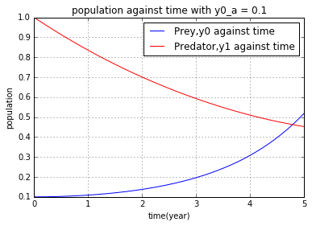
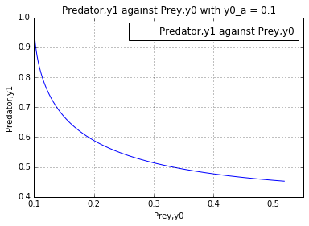
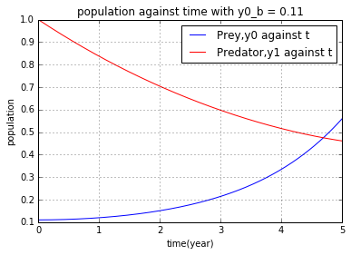
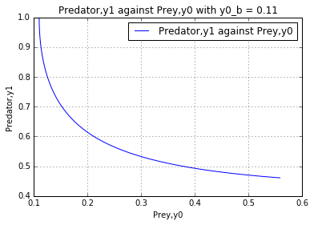

UECM3033 Assignment #3 Report
========================================================

- Prepared by: Lim Sip Yee
- Tutorial Group: T3

--------------------------------------------------------

## Task 1 --  Gauss-Legendre formula

The reports, codes and supporting documents are to be uploaded to Github at: 

[https://github.com/sipyeelim/UECM3033_assign3.git](https://github.com/sipyeelim/UECM3033_assign3.git)

Explain how you implement your `task1.py` here.

In task 1, perform the Gauss-Legendre integration, we initially need to ensure the interval is between - 1 and 1 so before we get into the formula.By using leggauss from the module numpy.polynomial.legendre, we can obtain the weights and nodes in the Gauss-Legendre quadrature. Before doing this process, we need to use Lagrange polynomial to tranfrom the interval, y = a((x-1)/(-1-1)) + b((x+1)/(1+1)) and also need to use the jacobian (b-a)/2 for this transformation. After it transformed the nodes x into a new variable, namely y, then took the dot product of f(y), weight and the jacobian (b-a)/2 to get the answer. 

Explain how you get the weights and nodes used in the Gauss-Legendre quadrature.
By using leggauss from the module numpy.polynomial.legendre to obtain the weights and nodes.
---------------------------------------------------------

## Task 2 -- Predator-prey model

Explain how you implement your `task2.py` here, especially how to use `odeint`.

First we define the ode to store the ODE system which has 4 parameters, y = [y0,y1], t = np.linspace(0, 5, 1001), a and b. After that, stor the given value into a, b and y and set the t be np.linspace(0, 5, 1001) which is 1000 uniform partition from t = 0 to 5. Finally, used the odeint from the module scipy.integrate to solve this nonlinear ODE system. 

Put your graphs here and explain.
When the y0 is 0.1 and y1 is 1.0

When the y0 is 0.11 and y1 is 1.0

From the diagrams appeared above, there were only a minor changed in the ouput when there is a changed in the initial condition y0.Meanwhile,when the number of prey had all the earmarks of being most minimal when the quantity of predator is most elevated which demonstrates the converse relationship between this two.So, when the time increase, the prey will increase and dpredators will decrease.

Is the system of ODE sensitive to initial condition? Explain.
No, the system of ODE is not sensitive to initial condition. From the graph we can see there are not much difference in both case.

-----------------------------------

last modified: change your date here
